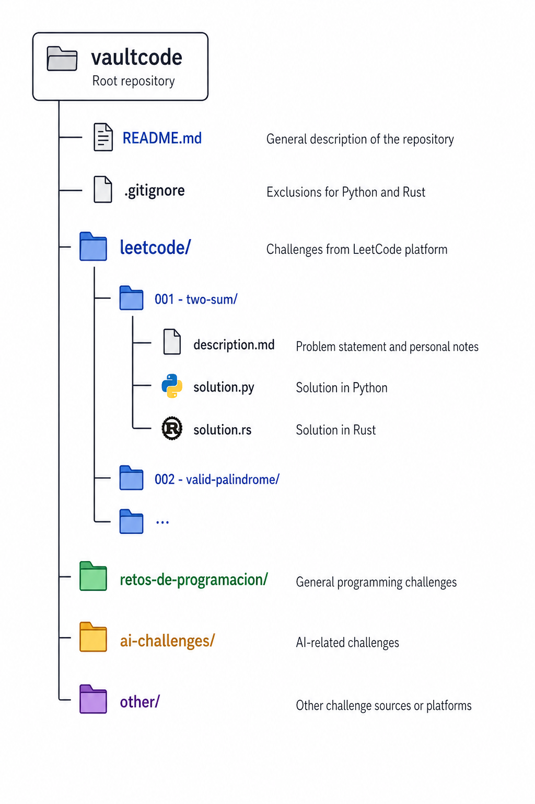

# 🔐 vaultcode

> A personal vault of coding challenges, solutions, and logic — built in Python and Rust.

---

## 📖 About

**vaultcode** is where I store every coding challenge I solve. The goal is simple: never lose a good problem again. Each solution is documented with its description, approach, and code — building a personal archive of logical thinking over time.

Challenges come from multiple sources:
- [LeetCode](https://leetcode.com)
- [Retos de Programación](https://retosdeprogramacion.com)
- AI-generated challenges
- Other platforms and sources found along the way

---

## 🛠️ Languages

| Language | Role |
|----------|------|
| 🐍 Python | Primary language — fast to explore and prototype solutions |
| 🦀 Rust | Secondary language — used to deepen understanding of memory, performance and systems thinking |

---

## 📁 Repository Structure

<p align="center">
  
</p>

---

## 📝 Description File Format

​
# Challenge Title

**Source:** LeetCode / Retos de Programación / AI / Other  
**Difficulty:** Easy / Medium / Hard  
**Date:** YYYY-MM-DD  

## Problem

Problem statement goes here.

## Notes

What I found interesting or difficult about this one.


---

## 🌎 Documentation Language

The public-facing structure of this repository is kept in English: challenge descriptions, folder organization, and general documentation should be easy to scan from GitHub.

Personal solution notes may be written in Spanish when that makes the reasoning clearer. Those notes are part of the learning process, so the priority is to capture ideas, failed attempts, trade-offs, and implementation details naturally.

---

## 📌 Commit Convention

| Prefix | Meaning |
|--------|---------|
| `add:` | New challenge added and solved |
| `wip:` | Work in progress — solution not finished yet |
| `done:` | Finished a previously started challenge |
| `update:` | Improved or refactored an existing solution |
| `docs:` | Docs file added or modified |


**Example:**
​```
add: leetcode/001 - two sum (python)
wip: leetcode/003 - longest substring (python)
done: leetcode/003 - longest substring (python)
update: leetcode/001 - optimized solution
​```

---

## 🚀 Goals

- Build consistency in problem solving
- Grow proficiency in Rust through real challenges
- Never lose an interesting problem again
- Track personal progress and evolution over time

---

*Work in progress — growing one challenge at a time.*
